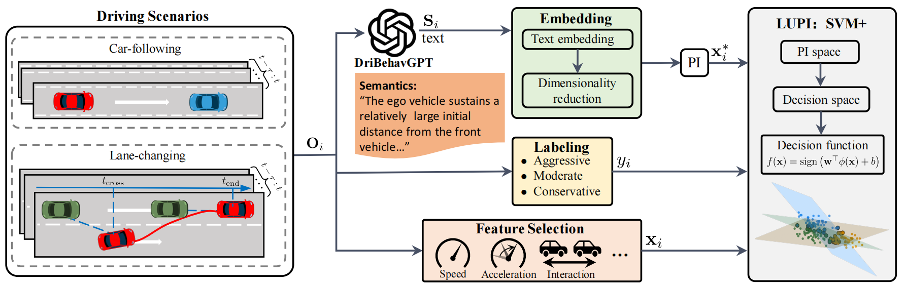

# Driving Style Recognition Like an Expert Using Semantic Privileged Information from Large Language Models

This repository maintains the project information and dataset details for the paper: **"Driving Style Recognition Like an Expert Using Semantic Privileged Information from Large Language Models"**.

## Abstract

Existing driving style recognition systems largely depend on low-level sensor-derived features for training, neglecting the rich semantic reasoning capability inherent to human experts. To bridge this gap, we propose a novel framework that integrates Semantic Privileged Information (SPI) derived from large language models (LLMs). This framework introduces DriBehavGPT to generate natural-language descriptions of driving behaviors, which are encoded into machine learning-compatible representations via text embedding and dimensionality reduction. Finally, these semantics are incorporated as privileged information into SVM+ for training.

## Data Availability Statement

This project utilizes two types of datasets: **Car-following** (self-collected) and **Lane-changing** (public benchmark).

### 1. Car-following Dataset (Self-collected)
The car-following data were collected from large-scale naturalistic driving experiments in Changchun, China, in collaboration with **FAW Group (China First Automobile Works)**.

*   **Status:** 🔒 **Confidential / Under Embargo**
*   **Reason:** The dataset is currently subject to a commercial confidentiality agreement (NDA) and strict data security regulations.
*   **Release Plan:** We are committed to open science. This dataset is scheduled to be released in this repository upon the expiration of the confidentiality period (**Expected: After 2027**).

#### Data Structure Description
Although the raw data cannot be shared at this moment, the processed kinematic features utilized in our LUSPI framework follow this format (CSV):

| Column Name | Unit | Description |
| :--- | :--- | :--- |
| `v_ego` | m/s | Ego vehicle speed |
| `a_lon` | m/s² | Ego vehicle longitudinal acceleration |
| `rel_dist` | m | Relative distance to the leading vehicle |
| `rel_speed` | m/s | Relative speed to the leading vehicle |
| `TTC` | s | Time-to-Collision |
| `Label` | - | Driving Style (0: Conservative, 1: Moderate, 2: Aggressive) |

### 2. Lane-changing Dataset (Public)
The lane-changing scenarios in our study are based on the **highD dataset**, a public benchmark of naturalistic vehicle trajectories recorded on German highways.

*   **Source:** The dataset is publicly available at the official website.
*   **Access:** Please request the data directly from: [https://www.highd-dataset.com/](https://www.highd-dataset.com/)
*   **Citation:**
    > R. Krajewski, J. Bock, L. Kloeker, and L. Eckstein, “The highd dataset: A drone dataset of naturalistic vehicle trajectories on german highways for validation of highly automated driving systems,” in *2018 21st International Conference on Intelligent Transportation Systems (ITSC)*. IEEE, 2018.

## Citation
If you find this work useful in your research, please consider citing our paper upon publication.
